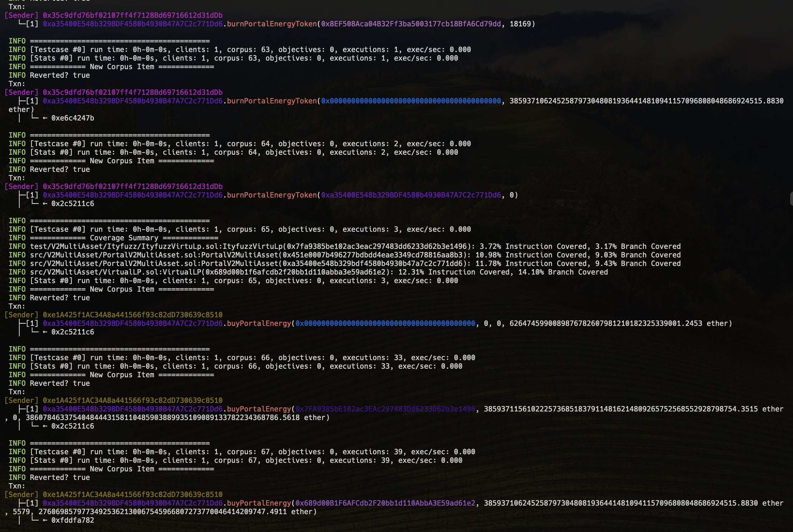

## Installation

To be able to use this repository, you need to have the following installed:

- [Foundry]( https://book.getfoundry.sh/getting-started/installation)
- [Halmos](https://github.com/a16z/halmos/tree/main)
- [Echidna]( https://github.com/crytic/echidna?tab=readme-ov-file#installation)


## Init:

```js
 git submodule update --init --recursive
```
```js
sudo forge build -force
```
### You can find more information on this repository:
- [Example implementation](https://github.com/ZealynxSecurity/Zealynx/blob/main/OurWork/Fuzzing-and-Formal-Verification/public-contests/Olas%20Protocol/Readme-Olas.md)

## Where to find the tests

You can find the tests in various folders:

- Echidna in the `src/V2MultiAsset/Echidna` folder
- Foundry in the `test/V2MultiAsset/Foundry` folder
- Halmos in the `test/V2MultiAsset/Halmos` folder
- Ityfuzz in the `test/V2MultiAsset/Ityfuzz` folder


# Testing Environments


## Foundry

### Resources to set up environment and understand approach

- [Documentation](https://book.getfoundry.sh/)
- [Create Invariant Tests for DeFi AMM Smart Contract](https://youtu.be/dWyJq8KGATg?si=JGYpABuOqR-1T6m3)

### Where are tests

- Foundry in the `test/V2MultiAsset/Foundry` folder

### How to run them

#### PortalV2MultiAsset

- test/V2MultiAsset/Foundry/ZealynxPortalV2MultiAssetTest.t.sol
  
```solidity
forge test --fork-url https://arb-mainnet.g.alchemy.com/v2/APY --mc ZealynxVirtualLPTest
```

#### VirtualLP

- test/V2MultiAsset/Foundry/ZealynxVirtualLPTest.t.sol

```solidity
forge test --fork-url https://arb-mainnet.g.alchemy.com/v2/APY --mc ZealynxPortalV2MultiAssetTest
```

## Echidna

### Resources to set up environment and understand approach

- [Documentation](https://secure-contracts.com/index.html)
- [Properties](https://github.com/crytic/properties)
- [echidna](https://github.com/crytic/echidna)
- [Echidna Tutorial: #2 Fuzzing with Assertion Testing Mode](https://www.youtube.com/watch?v=em8xXB9RHi4&ab_channel=bloqarl)
- [Echidna Tutorial: #1 Introduction to create Invariant tests with Solidity](https://www.youtube.com/watch?v=yUC3qzZlCkY&ab_channel=bloqarl)
- [Echidna Tutorial: Use Echidna Cheatcodes while Fuzzing](https://www.youtube.com/watch?v=SSzh5GlqteI&ab_channel=bloqarl)


### Where are tests

- Echidna in the `src/V2MultiAsset/Echidna` folder

### How to run them

#### PortalV2MultiAsset

- src/V2MultiAsset/Echidna/test/EchidnaPortalV2MultiAsset.sol

```solidity
 echidna . --contract EchidnaPortalV2MultiAsset --config config.yaml
```
#### VirtualLP

- src/V2MultiAsset/Echidna/test/EchidnaVirtualLP.sol

```solidity
 echidna . --contract EchidnaVirtualLP --config config.yaml
```


## Halmos

### Resources to set up environment and understand approach

- [CheatCode](https://github.com/a16z/halmos-cheatcodes)
- [Documentation](https://github.com/a16z/halmos-cheatcodes)
- [Formal Verification In Practice: Halmos, Hevm, Certora, and Ityfuzz](https://allthingsfuzzy.substack.com/p/formal-verification-in-practice-halmos?r=1860oo&utm_campaign=post&utm_medium=web)
- [Examples](https://github.com/a16z/halmos/tree/main/examples)

### Where are tests

- Halmos in the `test/V2MultiAsset/Halmos` folder

### How to run them

#### PortalV2MultiAsset

- test/V2MultiAsset/Halmos/ZealynxHalmos_PortalV2.t.sol
  
```solidity
halmos --contract ZealynxHalmos_PortalV2 --solver-timeout-assertion 0
```


#### VirtualLP

- test/V2MultiAsset/Halmos/ZealynxHalmosVirtual.t.sol

```solidity
halmos --contract ZealynxHalmosVirtual --solver-timeout-assertion 0
```


## Ityfuzz

### Resources to set up environment and understand approach

- [GitHub](https://github.com/fuzzland/ityfuzz/tree/master)
- [Documentation](https://docs.ityfuzz.rs/)
- [Formal Verification In Practice: Halmos, Hevm, Certora, and Ityfuzz](https://allthingsfuzzy.substack.com/p/formal-verification-in-practice-halmos?r=1860oo&utm_campaign=post&utm_medium=web)
- [Examples](https://github.com/a16z/halmos/tree/main/examples)
- [Video examples](https://mirror.xyz/0x44bdEeB120E0fCfC40fad73883C8f4D60Dfd5A73/IQgirpcecGOqfWRozQ0vd8e5mLLjWfX5Pif2Fbynu6c)

### Where are tests

- Ityfuzz in the `test/V2MultiAsset/Ityfuzz` folder

### How to run them

- To run Ityfuzz, you need to delete the files in the "onchain" folder and comment out the files from Halmos.

#### PortalV2MultiAsset

- test/V2MultiAsset/Ityfuzz/ItyfuzzPortalV2MultiAsset.sol
  
```solidity
ityfuzz evm -m ItyfuzzPortalV2MultiAsset -- forge build

```


#### VirtualLP

- test/V2MultiAsset/Ityfuzz/ItyfuzzVirtuLp.sol

```solidity
ityfuzz evm -m ItyfuzzVirtuaLp -- forge build

```




# Test Coverage


## Echidna


### Test Cases


|  | Property | Contract | Tested | Echidna |
| --- | --- | --- | --- | --- |
| 1 | test_register_portal_usdc | VirtualLP | REGISTER PORTAL | ✅ |
| 2 | test_register_portal_eth | VirtualLP | REGISTER PORTAL | ✅ |
| 3 | test_revert_register_portal_not_owner | VirtualLP | REGISTER PORTAL | ✅ |
| 4 | test_address_changed_to_zero | VirtualLP | REMOVE OWNER | ✅ |
| 5 | test_revert_remove_owner | VirtualLP | REMOVE OWNER | ✅ |
| 6 | test_only_registered_portal_deposit_to_yield_source | VirtualLP | DEPOSIT TO YIELD SOURCE | ✅ |
| 7 | test_deposit_to_yield_source | VirtualLP | DEPOSIT TO YIELD SOURCE | ✅ |
| 8 | test_fuzz_deposit_to_yield_source | VirtualLP | DEPOSIT TO YIELD SOURCE | ✅ |
| 9 | test_only_registered_portal_withdraw_from_yield_source | VirtualLP | WITHDRAW FROM YIELD SOURCE | ✅ |
| 10 | test_withdraw_from_yield_source | VirtualLP | WITHDRAW FROM YIELD SOURCE | ✅ |
| 11 | test_convert | VirtualLP | PSM CONVERTER | ✅ |
| 12 | test_revert_with_invalid_recipient_address | VirtualLP | PSM CONVERTER | ✅ |
| 13 | test_revert_with_zero_min_amount | VirtualLP | PSM CONVERTER | ✅ |
| 14 | test_revert_with_zero_min_amount | VirtualLP | PSM CONVERTER | ✅ |
| 15 | test_reward_pool_adjustment | VirtualLP | PSM CONVERTER | ✅ |
| 16 | test_revert_after_deadline | VirtualLP | PSM CONVERTER | ✅ |
| 17 | test_revert_with_invalid_token_address | VirtualLP | PSM CONVERTER | ✅ |
| 18 | test_fuzz_convert | VirtualLP | PSM CONVERTER | ✅ |
| 19 | test_contribute_funding | VirtualLP | CONTRIBUTE FUNDING | ✅ |
| 20 | test_revert_contribute_funding | VirtualLP | CONTRIBUTE FUNDING | ✅ |
| 21 | test_revert_contribute_zero_funding | VirtualLP | CONTRIBUTE FUNDING | ✅ |
| 22 | test_contract_balance_after_contribute_funding | VirtualLP | CONTRIBUTE FUNDING | ✅ |
| 23 | test_funding_balance_increased | VirtualLP | CONTRIBUTE FUNDING | ✅ |
| 24 | test_bToken_minted | VirtualLP | CONTRIBUTE FUNDING | ✅ |
| 25 | test_fuzz_contribute_funding | VirtualLP | CONTRIBUTE FUNDING | ✅ |
| 26 | test_withdraw_funding | VirtualLP | WITHDRAW FUNDING | ✅ |
| 27 | test_revert_withdraw_zero_funding | VirtualLP | WITHDRAW FUNDING | ✅ |
| 28 | test_revert_withdraw_funding_lp_active | VirtualLP | WITHDRAW FUNDING | ✅ |
| 29 | test_contract_balance_after_withdraw_funding | VirtualLP | WITHDRAW FUNDING | ✅ |
| 30 | test_funding_balance_decreased | VirtualLP | WITHDRAW FUNDING | ✅ |
| 31 | test_bToken_burned | VirtualLP | WITHDRAW FUNDING | ✅ |
| 32 | test_fuzz_withdraw_funding | VirtualLP | WITHDRAW FUNDING | ✅ |
| 33 | test_revert_get_burn_value_psm_inactive_lp | VirtualLP | GET BURN VALUE PSM | ✅ |
| 34 | test_fuzz_get_burn_value_psm | VirtualLP | GET BURN VALUE PSM | ✅ |
| 35 | test_revert_burn_zero_b_tokens | VirtualLP | BURN B TOKENS | ✅ |
| 36 | test_fuzz_burn_b_tokens | VirtualLP | BURN B TOKENS | ✅ |


## Foundry and Ityfuzz

`forge coverage`

| File | % Lines | % Statements | % Branches | % Funcs |
| --- | --- | --- | --- | --- |
| script/Counter.s.sol | 0.00% (0/1) | 0.00% (0/1) | 100.00% (0/0) | 0.00% (0/2) |
| src/V2MultiAsset/Echidna/EchidnaLogic.sol | 100.00% (44/44) | 100.00% (44/44) | 50.00% (3/6) | 100.00% (10/10) |
| src/V2MultiAsset/Echidna/utils/Debugger.sol | 15.38% (2/13) | 15.38% (2/13) | 100.00% (0/0) | 15.38% (2/13) |
| src/V2MultiAsset/MintBurnToken.sol | 100.00% (1/1) | 100.00% (1/1) | 100.00% (0/0) | 100.00% (1/1) |
| src/V2MultiAsset/PortalNFT.sol | 100.00% (22/22) | 100.00% (23/23) | 100.00% (2/2) | 66.67% (2/3) |
| src/V2MultiAsset/PortalV2MultiAsset.sol | 83.01% (127/153) | 85.11% (160/188) | 68.97% (40/58) | 93.75% (15/16) |
| src/V2MultiAsset/VirtualLP.sol | 75.57% (99/131) | 72.32% (128/177) | 71.43% (30/42) | 66.67% (16/24) |
| test/V2MultiAsset/Foundry/FoundryLogic.sol | 100.00% (44/44) | 100.00% (44/44) | 100.00% (0/0) | 100.00% (10/10) |
| test/V2MultiAsset/Foundry/FoundrySetup.sol | 100.00% (23/23) | 100.00% (24/24) | 100.00% (0/0) | 100.00% (1/1) |
| test/V2MultiAsset/mocks/MockToken.sol | 0.00% (0/1) | 0.00% (0/1) | 100.00% (0/0) | 0.00% (0/1) |
| Total | 83.60% (362/433) | 82.56% (426/516) | 69.44% (75/108) | 70.37% (57/81) |


### Test Cases

|  | Property | Contract | Tested | Foundry | Ityfuzz |
| --- | --- | --- | --- | --- | --- |
| 1 | testFuzzingStakeUSDC | PortalV2MultiAsset | Stake USDC | ✅ | ✅ |
| 2 | testFuzzingStakeETH | PortalV2MultiAsset | Stake ETH | ✅ | ✅ |
| 3 | testFuzz_Revert_stake_PortalNotRegistered | PortalV2MultiAsset | Portal Not Registered | ✅ | ✅ |
| 4 | testFuzz_Revert_stake_Zero | PortalV2MultiAsset | Stake Zero | ✅ | ✅ |
| 5 | testFuzz_Revert_stake_Ether | PortalV2MultiAsset | Stake Ether | ✅ | ✅ |
| 6 | testFuzz_Revert_stake_0_InvalidAmount | PortalV2MultiAsset | Invalid Amount | ✅ | ✅ |
| 7 | testUnstakeUSDC | PortalV2MultiAsset | Unstake USDC | ✅ | ✅ |
| 8 | testUnstakeETH | PortalV2MultiAsset | Unstake ETH | ✅ | ✅ |
| 9 | testMintNFTposition | PortalV2MultiAsset | Mint NFT | ✅ | ✅ |
| 10 | testMintNFTPositionFixedAccountAmount | PortalV2MultiAsset | Fixed Account Mint | ✅ | ✅ |
| 11 | testEmptyAccountMintNFTposition | PortalV2MultiAsset | Empty Account Mint | ✅ | ✅ |
| 12 | testRedeemNFTPosition | PortalV2MultiAsset | Redeem NFT | ✅ | ✅ |
| 13 | testRevertRedeemNFTposition | PortalV2MultiAsset | Redeem NFT Fail | ✅ | ✅ |
| 14 | testBuyPortalEnergy | PortalV2MultiAsset | Buy Energy | ✅ | ✅ |
| 15 | testRevertBuyPortalEnergy | PortalV2MultiAsset | Buy Energy Fail | ✅ | ✅ |
| 16 | test_register_portal_usdc | VirtualLP | Register Portal | ✅ | ✅ |
| 17 | test_register_portal_eth | VirtualLP | Register ETH Portal | ✅ | ✅ |
| 18 | test_revert_register_portal_not_owner | VirtualLP | Register Fail | ✅ | ✅ |
| 19 | test_address_changed_to_zero | VirtualLP | Change Owner | ✅ | ✅ |
| 20 | test_revert_remove_owner | VirtualLP | Remove Owner Fail | ✅ | ✅ |
| 21 | test_deposit_to_yield_source | VirtualLP | Deposit Yield | ✅ | ✅ |
| 22 | test_only_registered_portal_deposit_to_yield_source | VirtualLP | Deposit Registered | ✅ | ✅ |
| 23 | test_fuzz_deposit_to_yield_source | VirtualLP | Fuzz Deposit | ✅ | ✅ |
| 24 | test_only_registered_portal_withdraw_from_yield_source | VirtualLP | Withdraw Registered | ✅ | ✅ |
| 25 | test_fuzz_withdraw_from_yield_source | VirtualLP | Fuzz Withdraw | ✅ | ✅ |
| 26 | test_convert | VirtualLP | Convert | ✅ | ✅ |
| 27 | test_revert_with_invalid_recipient_address | VirtualLP | Invalid Recipient | ✅ | ✅ |
| 28 | test_revert_with_zero_min_amount | VirtualLP | Zero Min Amount | ✅ | ✅ |
| 29 | test_reward_pool_adjustment | VirtualLP | Reward Adjustment | ✅ | ✅ |
| 30 | test_correct_token_transfer | VirtualLP | Token Transfer | ✅ | ✅ |
| 31 | test_revert_with_invalid_token_address | VirtualLP | Invalid Token Address | ✅ | ✅ |
| 32 | test_revert_after_deadline | VirtualLP | After Deadline | ✅ | ✅ |
| 33 | test_revert_insufficient_balance | VirtualLP | Insufficient Balance | ✅ | ✅ |
| 34 | test_fuzz_convert | VirtualLP | Fuzz Convert | ✅ | ✅ |


## HALMOS

### Test Cases


|  | Property | Contract | Tested | Halmos |
| --- | --- | --- | --- | --- |
| 1 | check_getBurnValuePSM | VirtualLP | Burn value calculation | ✅ |
| 2 | check_BurnValue_Within_Min_Max | VirtualLP | Burn value limits | ✅ |
| 3 | check_Calculation_Logic_of_BurnValue | VirtualLP | Calculation logic | ✅ |
| 4 | check_BurnValue_Changes_Over_Time | VirtualLP | Time-dependent change | ✅ |
| 5 | check_BurnValue_BlockTimestamp_Changes_Over_Time | VirtualLP | Time block effect | 📝 |
| 5 | check_BurnableBTokenAmountLogic | PortalVirtualV2 | Burnable token logic | ✅ |
| 6 | check_BurnableBTokenAmount_Changes_Over_Time | PortalVirtualV2 | Burnable token time change | ✅ |
| 7 | check_stake | PortalVirtualV2 | Staking functionality | ✅ |
| 8 | check_Incariant_Stake | PortalVirtualV2 | Staking invariance | ✅ |
| 9 | check_PortalEnergy_TimeAndLockChange | PortalVirtualV2 | Portal energy time and lock change | ✅ |
| 10 | check_PortalEnergyImpactOnTimeAndLock | PortalVirtualV2 | Energy impact on time and lock | ✅ |
| 11 | check_DetailedPortalEnergyTimeLockAdjustments | PortalVirtualV2 | Detailed energy and time-lock adjustments | ✅ |
| 12 | check_PortalEnergyAdjustmentNegativeImpact | PortalVirtualV2 | Negative adjustment impact | ✅ |

